# Objectif
This document describes how to urgently deploy a Microsoft patch.
This deployment is for a patch so urgent that it must be done outside of your Company's WSUS schedule.

# Requirments

* Have an AD group containing the stations to be patched,
* Have the .msu file available on [the Microsoft site](https://www.catalog.update.microsoft.com/) ,
* Have a shared directory (readable and executable for the group mentioned above) on the network in order to store the .msu file(s) to be deployed.
* Put the.bat file in the Scripts folder of the Sysvol.
* Have WinRM activated in the case of a non-domain client.

> In the rest of this documentation, I use a dedicated directory on the WSUS server for storing the .msu file.
> We will use the .msu file "kb3186568"

# Présentation

Lab presentation : 

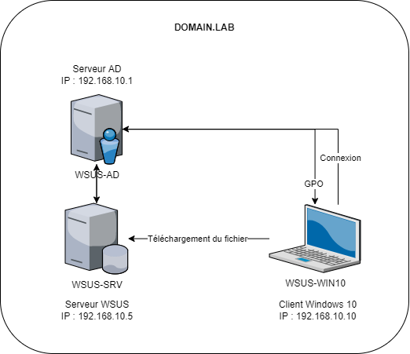

Presentation of the group containing the client workstations :

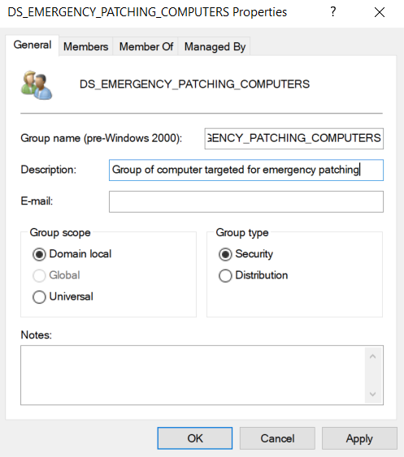

Présentation of the Share folder :

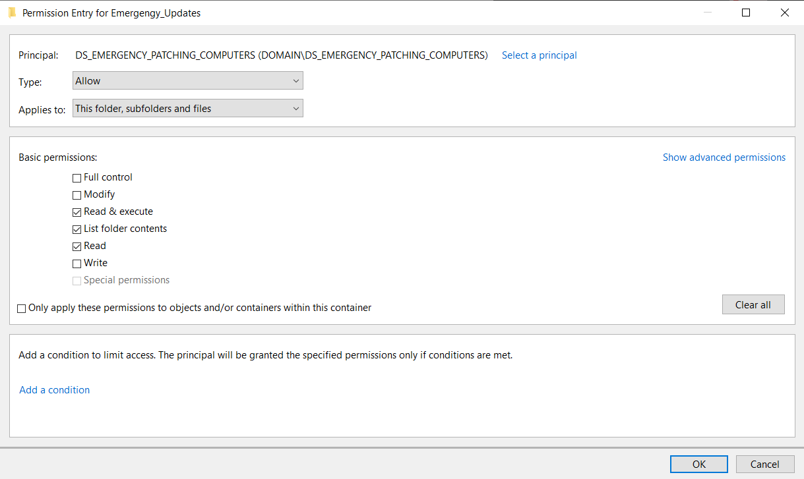

# File control

As update files can sometimes be large and the network is not always stable, it is advisable to check that the file has not been altered during the upload to the target server.
Once the upload has been carried out in the directory, all that remains is to check that the sum is identical between the download on your computer and that of the client via the Powershell command: Get-FileHash -Algorithm SHA256 .\File

# Computer in Active Directory

## Solution 1 : Scheduled task with automatic execution
### Advantages and disadvantages

Advantages :
* The update deploys as soon as the GPO synchronizes

Disadvantages:
* The update can be done while the target is heavily used,
* Difficulty of tracking (the GPO goes down between 90 and 120min).

> Why not use Invoke-gpupdate? Because if your 300 workstations come at the same time to type the same file you risk the bottleneck, also you will have to activate WinRM and add the authorization in your firewalls.

### Make the GPO

* Launch Group Policy Management
* Go to Forest > Domains >domain.lab > Group Policy Objects

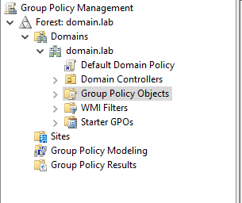

> You never create a GPO in the OU where you will assign it later. When it is created, it has the default group "authenticated users" which means that it will have an OU and all the members (not only wich you want) of the OU for the assignment.

* Right click > New GPO
* Create GPO "C_EMERGENCY_UPDATE"
> C for Computer, The rest to quickly understand the role of the GPO.

* Select your GPO et edit it.
* Click on the name and select "Properties"

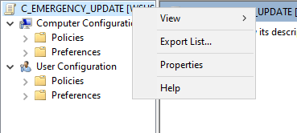

* Check "Disable User Configuration settings"

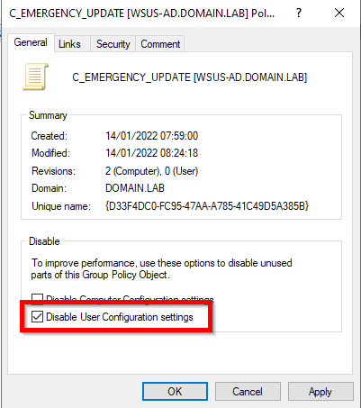

* In the Comment tab, enter the current date, the KB number to deploy and the ticket number and your username
> This GPO will be reusable, by adding this information to each deployment, we can have a history of use, consult tickets to see problems encountered previously, etc.

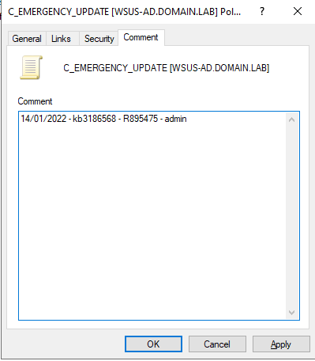

* Go to Preferences > Control Panel Settings > Scheduled Task

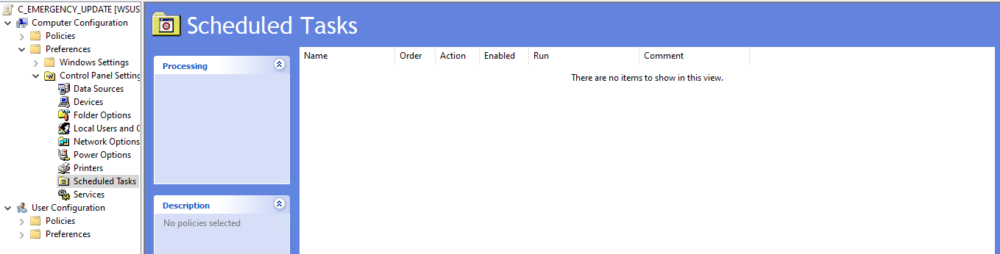

* In the right panel, right click and select New > Immediate Task (At least Windows 7)

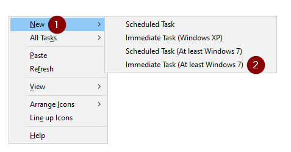

* Fill in the General tab
> In the lab, I use the Administrator account, but any account with local administrator rights and read/execute in the shared directory is enough.

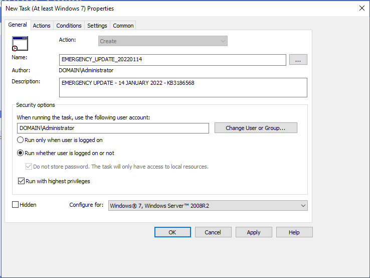

* Fill in the Actions tab

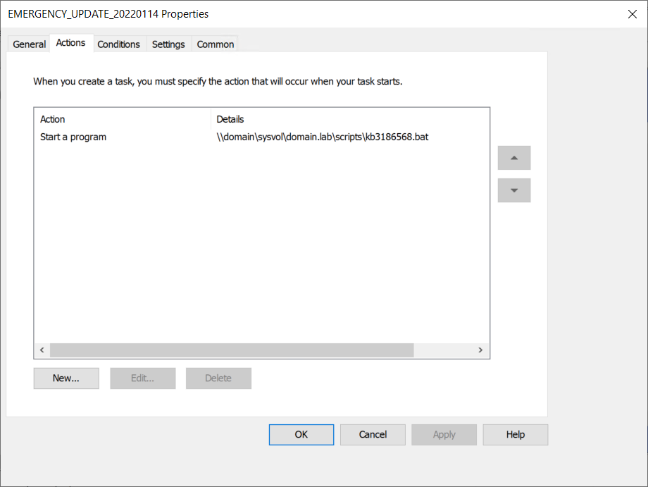

* Fill in the Conditions tab

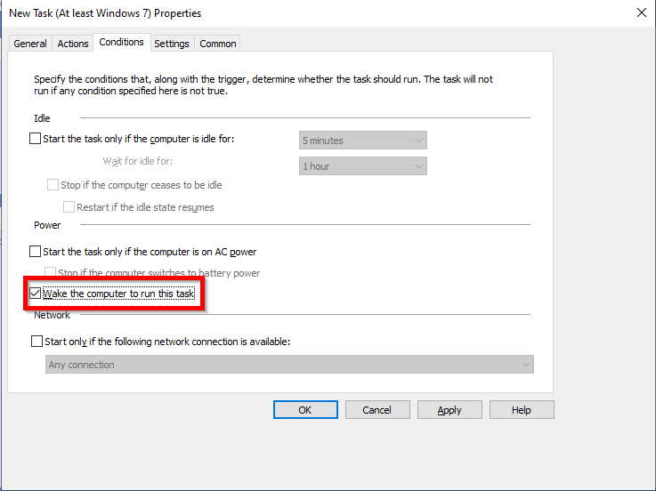

* Fill in the Settings tab

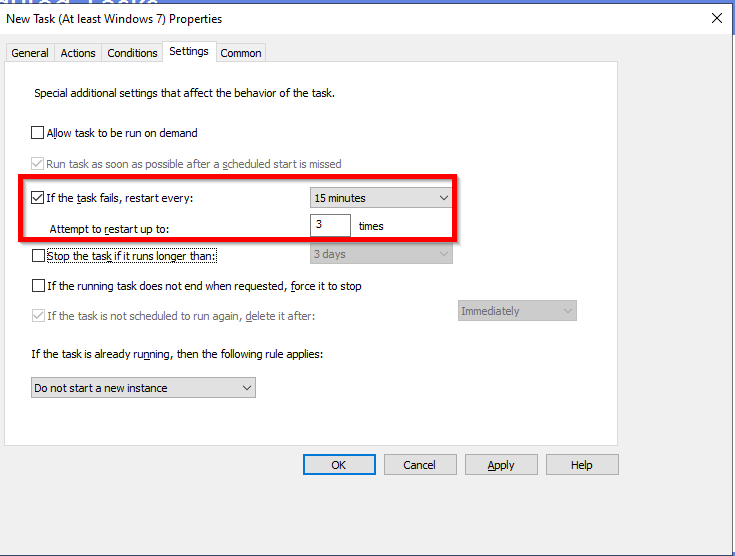

* Fill in the Common tab

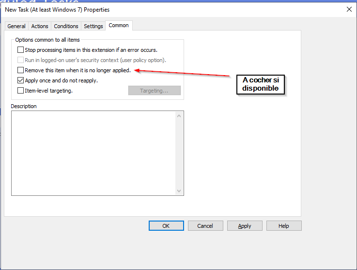

* Save and exit the GPO.
* Assign the GPO to the OU containing the workstations to be patched.

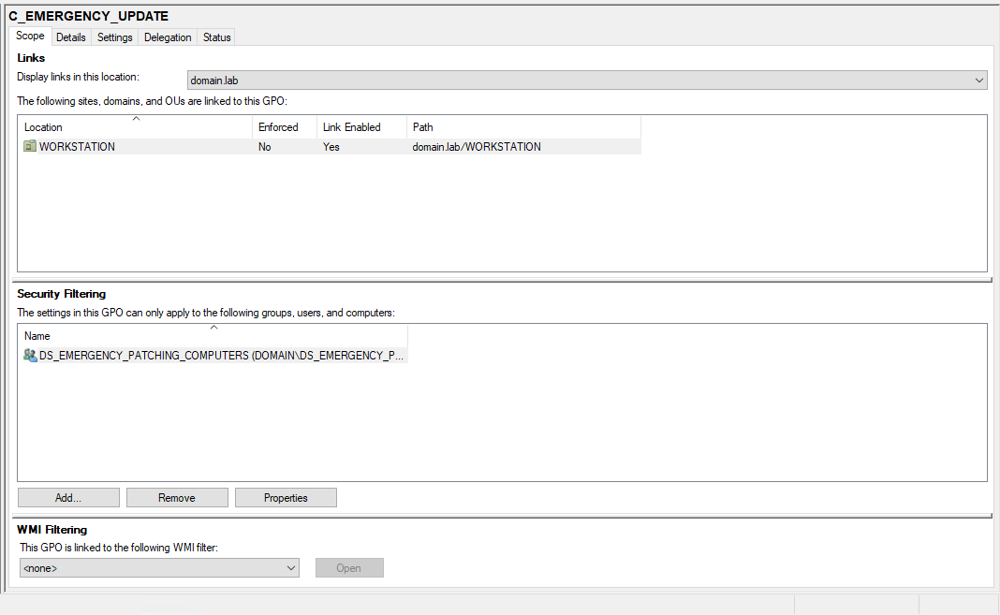

* Wait for the GPO to descend (between 90 and 120 minutes)

## Solution 2: At reboot
### Advantages and disadvantages
Advantages :
* Update deploys on scheduled reboot

Disadvantages:
* Requires a maintenance window for scheduled reboots

### Make the GPO

* Launch Group Policy Management
* Go to Forest > Domains >domain.lab > Group Policy Objects

> You never create a GPO in the OU where you will assign it later. When it is created, it has the default group "authenticated users" which means that it will have an OU and all the members (not only wich you want) of the OU for the assignment.

* Right click > New GPO
* Create GPO "C_EMERGENCY_UPDATE"
> C for Computer, The rest to quickly understand the role of the GPO.

* Select your GPO et edit it.
* Click on the name and select "Properties"

* Check "Disable User Configuration settings"

* In the Comment tab, enter the current date, the KB number to deploy and the ticket number and your username
> This GPO will be reusable, by adding this information to each deployment, we can have a history of use, consult tickets to see problems encountered previously, etc.

* Go to Policies > Windows Settings > Scripts (Startup/Shutdown)
* Choose whether the script should be done at startup or at shutdown
* Select "add script"

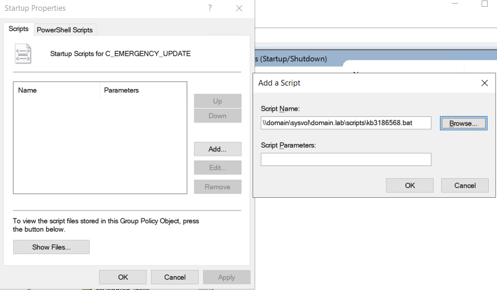

* Save and exit the GPO.
* Assign the GPO to the OU containing the workstations to be patched.

# Computer out of Active Directory
## If you have only one or two

* Use Invoke-Command -ComputerName Server01, Server02 -ScriptBlock {wusa.exe \\WSUS-SRV\Emergengy_Updates\windows10.0-kb3186568-x64_086bd10d344a5bb614725135a1589cd784d1e768.msu /quiet /norestart}

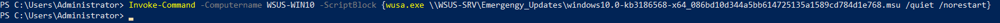

## If you have several

* Use the script Multi_DMZ.ps1 to make the command above with a computers list in a csv file.

# Deployment control using SIEM
If the customer has a SIEM, you must look for eventID 2 in the "Installations" log of each computer.

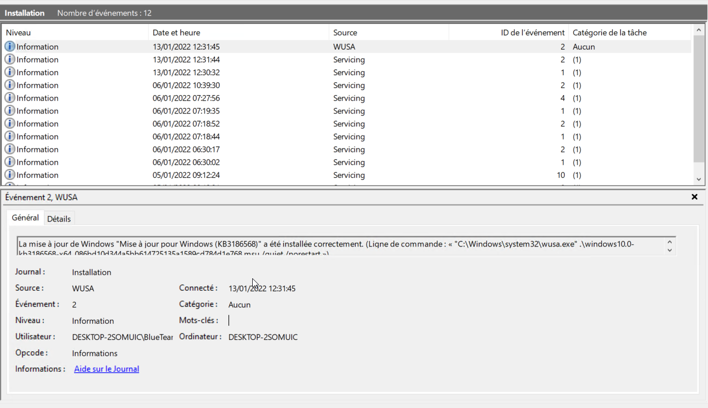

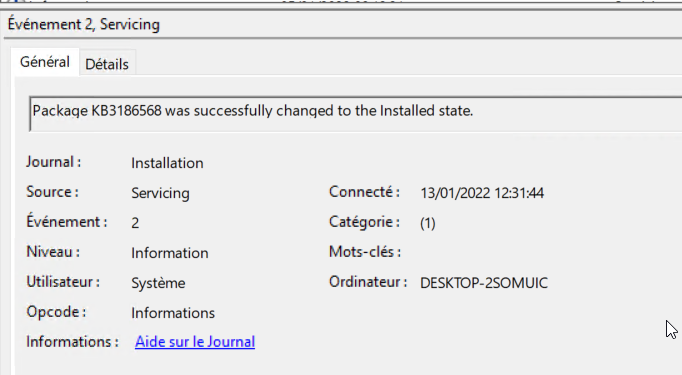

# Post-Deployment
Once the deployment is finished, deactivate the GPO, delete the link with the OU and the workstation group.
If you forget, the installation will be launched at regular intervals, generating noise in the logs.

# Sources

[Article sur le blog]https://www.geekmunity.fr/?p=2291

[Get-FileHash](https://docs.microsoft.com/en-us/powershell/module/microsoft.powershell.utility/get-filehash?view=powershell-7.2)

[WUSA.exe](https://ss64.com/nt/wusa.html)

[Invoke-Command](https://docs.microsoft.com/en-us/powershell/module/microsoft.powershell.core/invoke-command?view=powershell-7.2)