# Objectif
Le présent document présente comment déployer en urgence un correctif Microsoft.
Ce déploiement concerne un patch si urgent qu'il doit être fait en dehors du planning prévu par le WSUS de votre Entreprise.

# Prérequis

* Avoir un groupe AD comportant les postes à patcher,
* Disposer du fichier .msu disponible sur [le site de Microsoft](https://www.catalog.update.microsoft.com/) ,
* Disposer d'un répertoire partagé (en lecture et éxécution pour le groupe cité plus haut) sur le réseau afin d'y stocker le(s) fichier(s) .msu a déployer.
* Mettre le fichier.bat dans le dossier Scripts du Sysvol.
* Avoir WinRM d'activé dans le cas d'un poste hors domaine.

> Dans le reste de la documentation, j'utilise un répertoire dédié sur le serveur WSUS pour le stockage du fichier .msu.
> Nous utiliserons le fichier .msu "kb3186568".

# Présentation du LAB

Plan du LAB : 

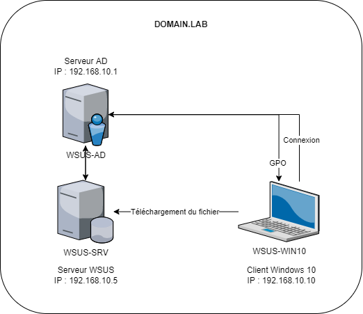

Présentation du groupe contenant les postes clients :

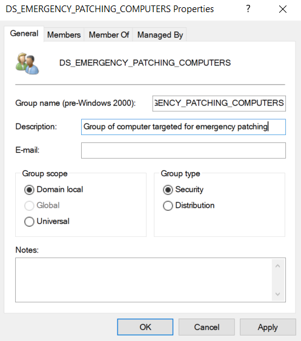

Présentation du Partage :

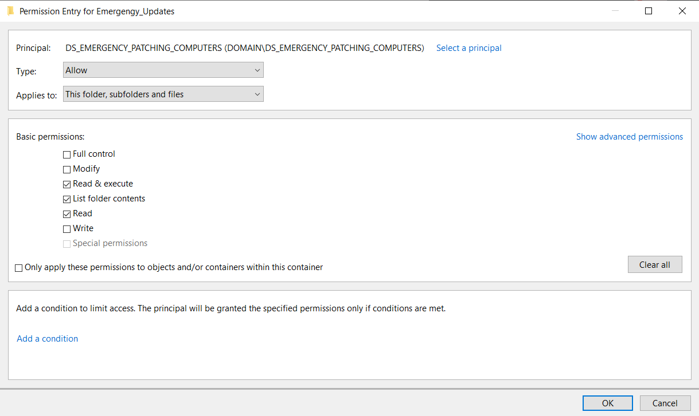

# Contrôle du fichier

Les fichiers de mises pouvant parfois être volumineux et le réseau n'étant pas toujours stable, il convient de vérifier que le fichier n'a pas été altérer lors du téléversement vers le serveur cible.
Une fois le téléversement effectué dans le répertoire, il ne reste plus qu'à vérifier que la somme est identique entre le téléchargement sur votre poste et celui du client via la commande Powershell : Get-FileHash -Algorithm SHA256 Fichier

Si vous possedez déjà un Hash : "Valeur_1" -eq "Valeur_2"

# Postes dans le domaine

## Solution 1 : Tâche planifiée a éxécution automatique
### Avantage et inconvénients

Avantages :
* La mise à jour se déploie des que la GPO se synchronise

Inconvénients :
* La mise à jour peut se faire pendant que la cible est fortement solicité
* Difficulté de suivi (la GPO descend entre 90 et 120min).

> Pourquoi ne pas forcer la descente via gpupdate ? Parce que si vos 300 postes viennent en même temps taper le même fichier vous risquez le goulet d'étranglement, sans compter qu'il vous faudra activer WinRM et ajouter l'autorisation dans vos pare-feu.

### Création de la GPO

* Executer Group Policy Management
* Se rendre dans Forest > Domains >domain.lab > Group Policy Objects

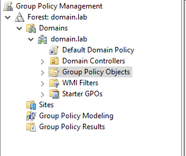

> On ne créer jamais une GPO dans l'OU où on l'affectera ultérieurement. A sa création, elle a aprt défaut le groupe "authenticated users" ce qui veux dire qu'elle aura une OU et tout les membres de l'OU pour l'affectation.

* Clic droit > New GPO
* Nommer la GPO "C_EMERGENCY_UPDATE"
> C pour Computer, Le reste permettant de comprendre rapidement le rôle de la GPO.

* Sélectionner la GPO et éditer la à l'aide du clic droit
* Sélectionner le nom de la GPO puis "Properties"

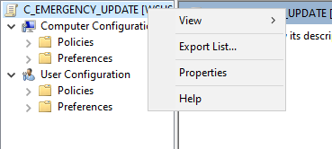

* Cocher "Disable User Configuration settings

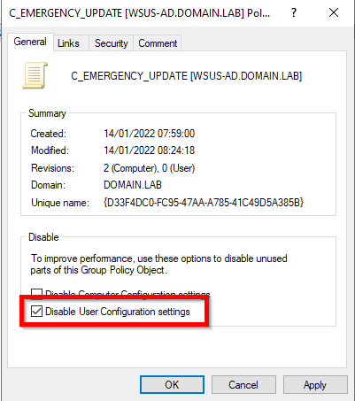

* Dans l'onglet Comment, renseigner la date du jour, le numéro de KB a déployer et le numéro de ticket et votre trigramme
> Cette GPO sera réutilisable, en ajoutant a chaque déploiement ces informations nous pouvons avoir un historique de l'utilisation, consulter les tickets pour voir les problèmes rencontrés précédemment, etc.

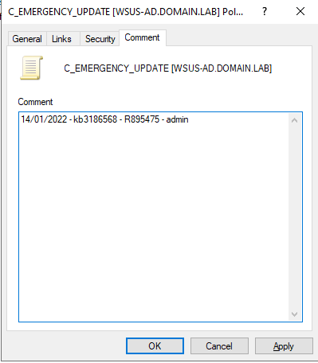

* Se rendre dans Preferences > Control Panel Settings > Scheduled Task

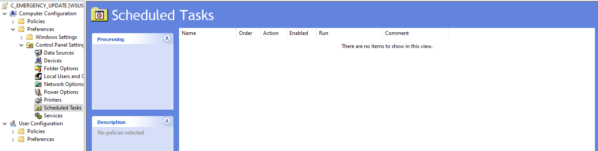

* Dans la partie droite, faire un clic droit et sélectionner New > Immediate Task (At least Windows 7)

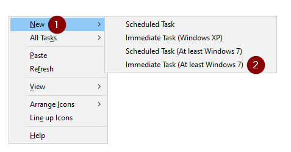

* Remplir l'onglet Général
> Dans le lab, j'utilise le compte Administrator, mais n'importe quel compte avec les droits administrateur local et lecture/éxécution dans le repertoire partagé suffit.

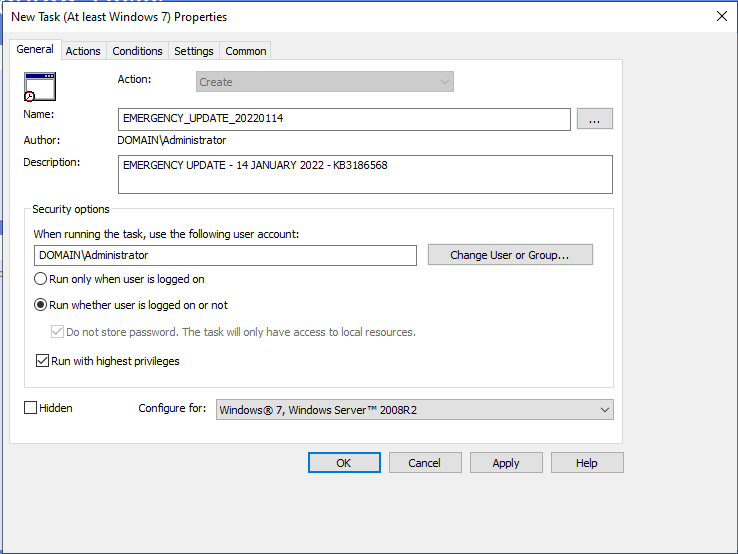

* Remplir l'onglet Actions

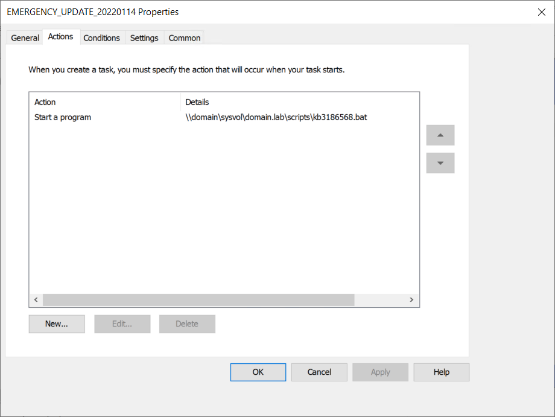

* Remplir l'onglet Conditions

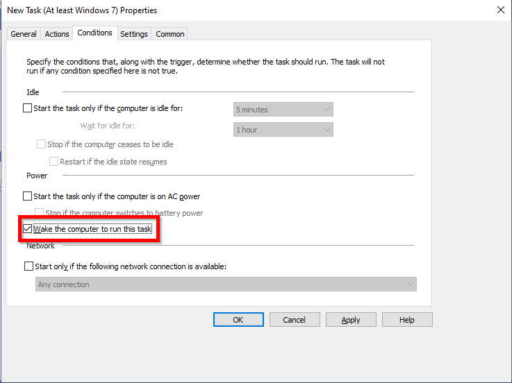

* Remplir l'onglet Settings

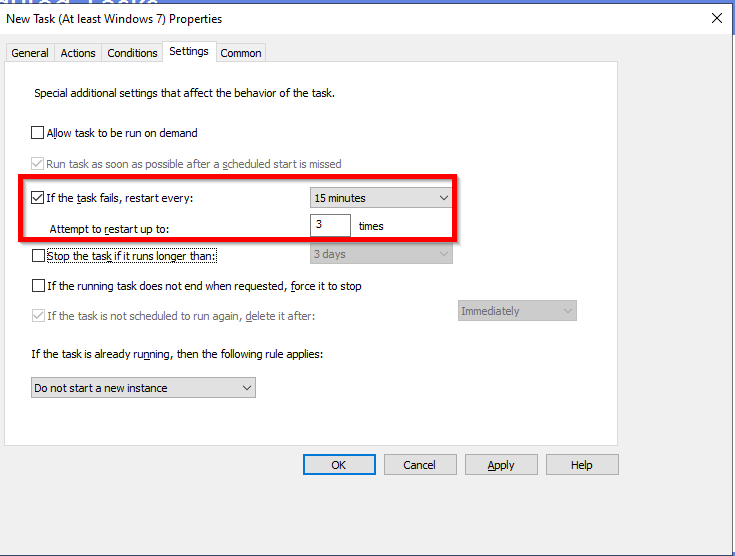

* Remplir l'onglet Common

* Quitter l'édition de la GPO.
* Attribuer la GPO à l'OU contenant les postes à patcher.

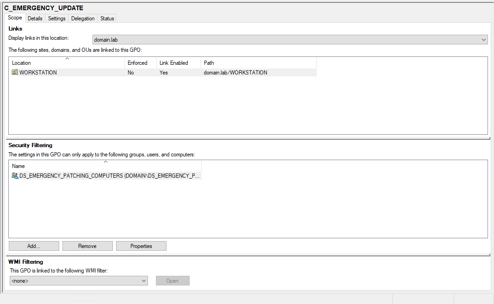

* Patienter entre 90 et 120 minutes le temps que la GPO descente

## Solution 2: au redémarrage
### Avantage et inconvénients
Avantage :
* La mise à jour se déploie dès le redémarrage planifié

Inconvénient :
* Nécessite un créneau de maintenance pour planifié les redémarrages

### Création de la GPO

Executer Group Policy Management
* Executer Group Policy Management
* Se rendre dans Forest > Domains >domain.lab > Group Policy Objects

* Clic droit > New GPO
* Nommer la GPO "C_EMERGENCY_UPDATE"
> C pour Computer, Le reste permettant de comprendre rapidement le rôle de la GPO.

* Sélectionner la GPO et éditer la à l'aide du clic droit
* Sélectionner le nom de la GPO puis "Properties"

* Cocher "Disable User Configuration settings

* Dans l'onglet comment, renseigner la date du jour, le numéro de KB a déployer et le numéro de ticket et votre trigramme
> cette GPO sera réutilisable, en ajoutant a chaque déploiement ces informations nous pouvons avoir un historique de l'utilisation, consulter les tickets pour voir les problèmes rencontrés précédemment, etc.

* Se rendre dans Policies > Windows Settings > Scripts (Startup/Shutdown)
* Choisir si le script doit se faire au démarrage (Strtup) ou à l'arrêt (Shutdown)
* Ajouter le script

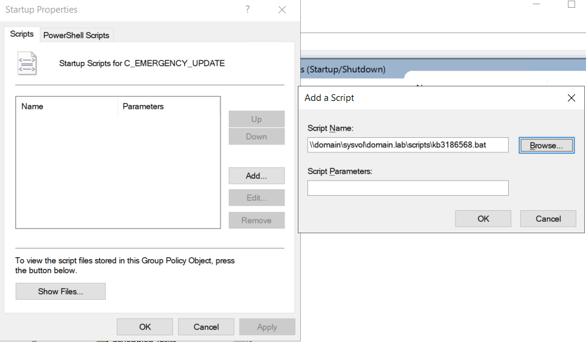

* Quitter l'édition de la GPO.
* Attribuer la GPO à l'OU contenant les postes à patcher.

# Poste hors domaine
## Mono Poste hors Domaine

* Utiliser la commande Invoke-Command -ComputerName Server01, Server02 -ScriptBlock {wusa.exe \\WSUS-SRV\Emergengy_Updates\windows10.0-kb3186568-x64_086bd10d344a5bb614725135a1589cd784d1e768.msu /quiet /norestart}

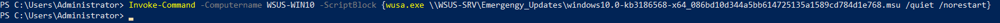

## Multiple Postes hors domaine (A tester en date du 14 janvier 2022)

* Utiliser le script Multi_DMZ.ps1

# Controle déploiement via SIEM
Dans le cas où le client dispose d'un SIEM il faut chercher l'eventID  2 du log "Installations".

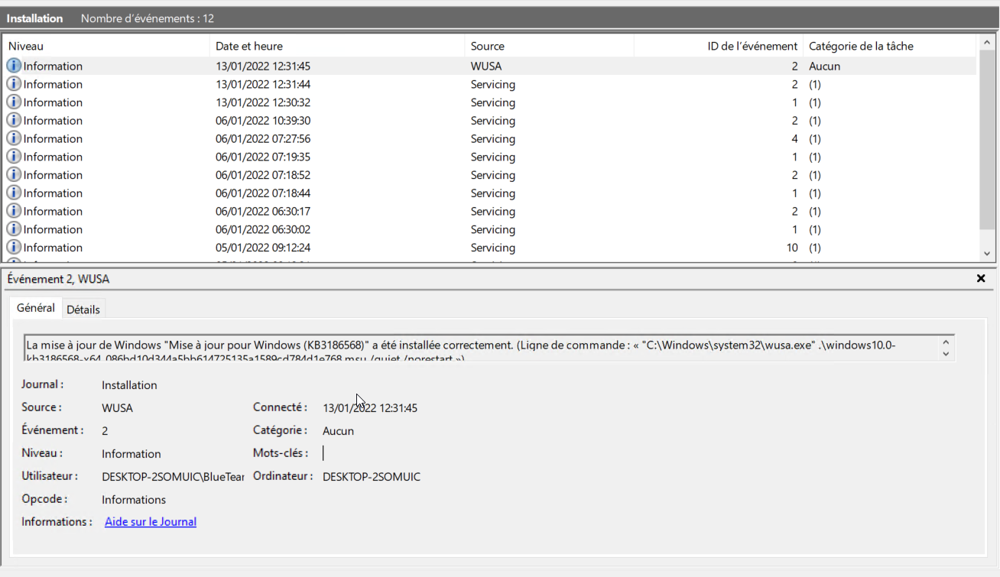

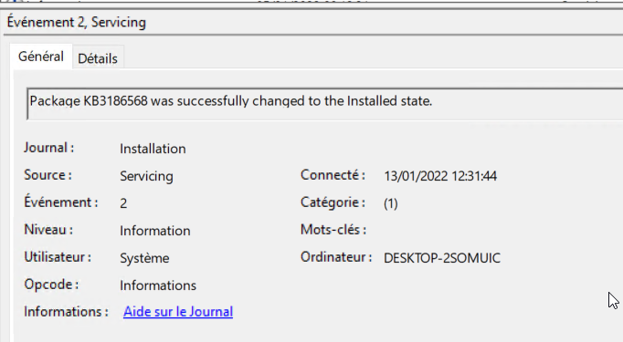

# Post-Déploiement
Une fois le déploiement fini, désactiver la GPO, supprimer le lien avec l'OU et le groupe de postes.
En cas d'oubli, le lancement de l'installation se fera à intervalles réguliers, générant du bruit dans les logs.

# Sources

[Article sur le blog]https://www.geekmunity.fr/?p=2291

[Get-FileHash](https://docs.microsoft.com/en-us/powershell/module/microsoft.powershell.utility/get-filehash?view=powershell-7.2)

[WUSA.exe](https://ss64.com/nt/wusa.html)

[Invoke-Command](https://docs.microsoft.com/en-us/powershell/module/microsoft.powershell.core/invoke-command?view=powershell-7.2)
